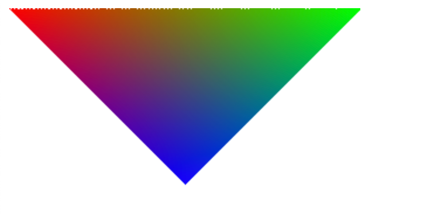
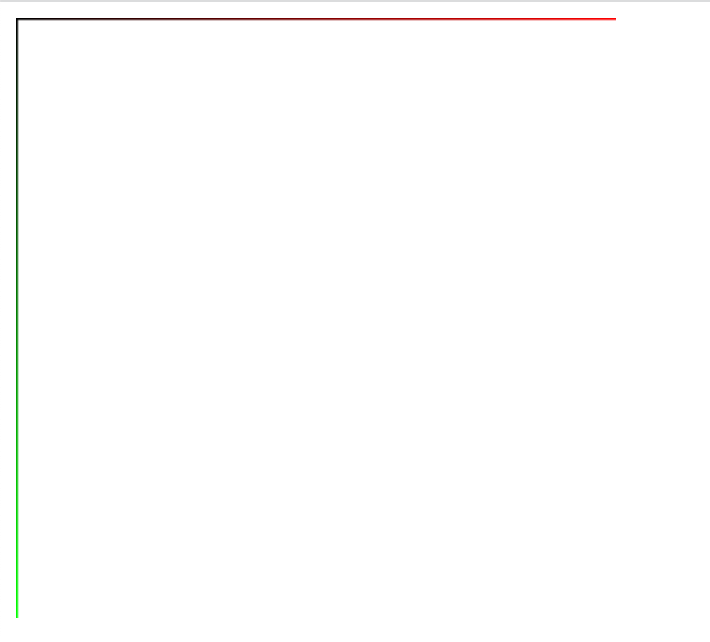
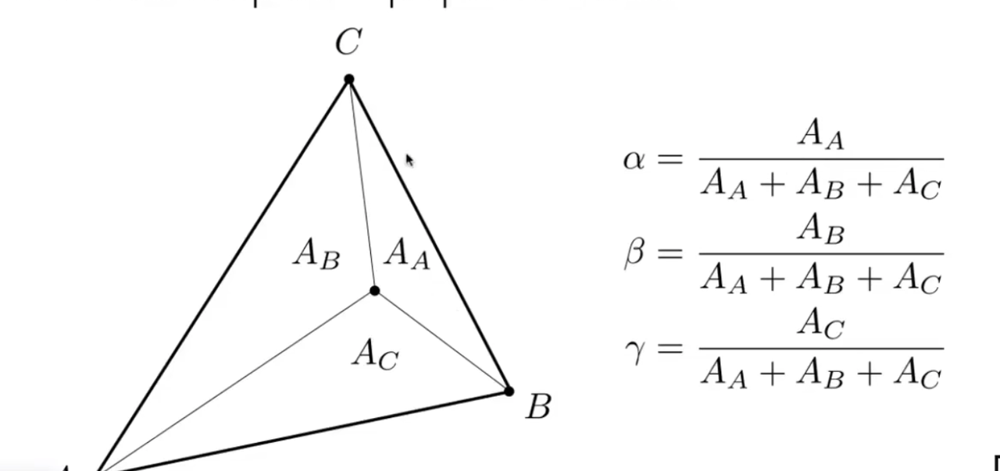
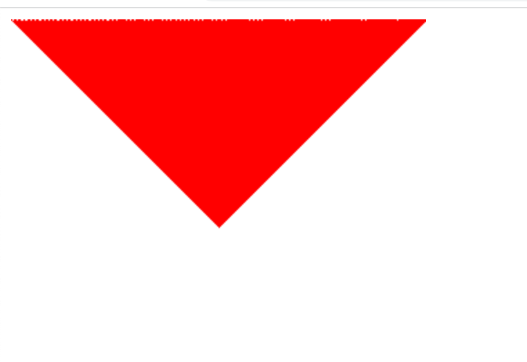

## **本节目标**
1. 输入一个三角形的三个顶点(x,y,z)，已及其对应的颜色值(r,g,b);
2. 输出一个有颜色过渡的三角形在屏幕上


完整实现可参见`demos/1-Start`
## 准备工作
### **1.参考资料**
1. [计算机图形学：基础入门][1]
2. [线性代数：线性代数的本质][2]
3. [数学基础：数学乐][3]
4. [前端基础：HTML][4]
5. [前端基础：Canvas][5]
6. [前端基础：ImageData][6]
7. [前端基础：Webpack][7]

[1]:https://www.bilibili.com/video/BV1X7411F744
[2]:https://www.bilibili.com/video/BV1ys411472E
[3]:https://www.shuxuele.com/
[4]:https://developer.mozilla.org/zh-CN/docs/Web/HTML
[5]:https://developer.mozilla.org/zh-CN/docs/Web/API/Canvas_API
[6]:https://developer.mozilla.org/zh-CN/docs/Web/API/Canvas_API/Tutorial/Pixel_manipulation_with_canvas
[7]:https://webpack.docschina.org/concepts/

```html
   <canvas id='canvas'> </canvas>
```
```typescript
    // canvas画布
    const canvas:HTMLCanvasElement = document.getElementById('canvas') as HTMLCanvasElement;
    // canvas 2d上下文
    const ctx:CanvasRenderingContext2D = canvas.getContext('2d');
    // canvas像素数据  
    const imageData:ImageData = ctx.createImageData(canvas.width, canvas.height);
    const pixelData:Uint8ClampedArray = imageData.data;
```

### **2.环境搭建**
1. 初始化ts环境 
```shell
    // 如果没有node 请先安装node 具体google
    // 如果没有安装过typescript，则需要先执行 npm install -g typescript 安装，再执行
    tsc --init
```

2. 初始化npm环境
```shell
    npm init // 根据提示初始化Project即可
```
3. 创建`index.html`
```html
    <!DOCTYPE html>
    <html lang="en">
    <head>
        <title>软件渲染器</title>
    </head>
    <body>
        <div id="root">
            <canvas id="canvas"></canvas>
            <script>"./dist/index.js"</script>
        </div>
    </body>
    </html>
```
4. 配置webpack
- 安装`webpack` `npm install -g webpack webpack-cli`
- 安装`HtmlWebpackPlugin`插件 `npm install -D html-webpack-plugin`
- 安装`ts-loader`和`file-loader` `npm install -D ts-loader file-loader`
- 编写`webpack.config.js`

```javascript
const path = require("path");
const HtmlWebpackPlugin = require("html-webpack-plugin");
module.exports = {
    mode: "development",
    entry: "./index.ts",
    devtool: "inline-source-map",
    module: {
        rules: [
            {
                test: /\.ts?$/,
                use: "ts-loader",
                exclude: /node_modules/,
            },
            {
                test: /\.(mtl|png|jpg|obj|tga)$/,
                use: "file-loader",
            },
        ],
    },
    resolve: {
        extensions: [".ts", ".js"],
    },
    plugins: [
        new HtmlWebpackPlugin({
            template: "./index.html",
            filename: "index.html",
        }),
    ],
    // 编译输出文件
    output: {
        filename: "index.js",
        path: path.resolve(__dirname, "dist"),
        clean: true,
    },
    // 本地调试预览
    devServer: {
        static :false,                              // webpack5去掉了contentBase，使用这个参数可以禁用static配置，使用旧的contentBase
        contentBase: path.join(__dirname, "dist"),
        compress: true,
        port: 9000,
    },
};

```

## **工作开始**
1. 搞清屏幕的x,y坐标系
- 准备工作
```typescript
// canvas画布
export function getCanvas(): HTMLCanvasElement {
    const canvas: HTMLCanvasElement = document.getElementById('canvas') as HTMLCanvasElement;
    return canvas;
}

// canvas 2d上下文
export function getContext(canvas: HTMLCanvasElement): CanvasRenderingContext2D {
    const ctx: CanvasRenderingContext2D = canvas.getContext('2d');
    return ctx;
}

// canvas像素数据 
export function createFrameBuffer(canvas: HTMLCanvasElement, ctx: CanvasRenderingContext2D): ImageData {
    const imageData: ImageData = ctx.createImageData(canvas.width, canvas.height);
    return imageData;
}

// canvas像素数据数组
export function getFrameBufferData(imageData: ImageData) {
    return imageData?.data;
}

// 根据x列+y行,获取像素值在imageData中的真实index
export function getIndex(x: number, y: number, width: number): number {
    return (x + y * width) * 4;
}

// 将像素数据放回canvas 达到渲染到canvas的效果
export function render(canvas: HTMLCanvasElement, ctx: CanvasRenderingContext2D, imageData: ImageData) {
    ctx.putImageData(imageData, 0, 0);
}

// 清除canvas颜色
export function clear(canvas: HTMLCanvasElement, ctx: CanvasRenderingContext2D, imageData: ImageData) {
    const frameData = getFrameBufferData(imageData);
    const { width, height } = canvas;
    for (let x = 0; x < width; ++x) {
        for (let y = 0; y < height; ++y) {
            const index = getIndex(x, y, width);
            frameData[index] = 255;
            frameData[index + 1] = 255;
            frameData[index + 2] = 255;
            frameData[index + 3] = 255;
        }
    }
}
```

- x/y轴分别以红/绿色填充,x/y越大,越红/绿
```typescript
const canvas = getCanvas();
const ctx = getContext(canvas);
const frameBuffer = createFrameBuffer(canvas, ctx);
const frameData = getFrameBufferData(frameBuffer);
clear(canvas, ctx, frameBuffer);

const { width, height } = canvas;

for (let x = 0; x < width; ++x) {
    for (let y = 0; y < height; ++y) {
        const index = getIndex(x, y, width);
        // x轴
        if (y == 0) {
            const index = getIndex(x, y, width);
            frameData[index] = 255 * x / width;
            frameData[index + 1] = 0;
            frameData[index + 2] = 0;
            frameData[index + 3] = 255;
        }
        // y轴
        if (x == 0) {
            frameData[index] = 0;
            frameData[index + 1] = 255 * y / height;
            frameData[index + 2] = 0;
            frameData[index + 3] = 255;
        }
    }
}

render(canvas, ctx, frameBuffer);
```


可以看出(0,0)点在左上角，x往右为正轴,y往下为正轴，是**右手系**


2. 实现x列,y行的像素颜色值读取和写入
```typescript
export class Color {
    r: number;
    g: number;
    b: number;
    a: number;
    constructor(r: number = 255, g: number = 255, b: number = 255, a: number = 255) {
        this.r = r;
        this.g = g;
        this.b = b;
        this.a = a;
    }
}

// 读取x列y行的像素颜色
export function readColor(frameBufferData: Uint8ClampedArray, x: number, y: number, width: number): Color {
    const index = getIndex(x, y, width);
    return new Color(
        frameBufferData[index],
        frameBufferData[index + 1],
        frameBufferData[index + 2],
        frameBufferData[index + 3])
}

// 将x行y列的像素颜色设置为color
export function writeColor(frameBufferData: Uint8ClampedArray, x: number, y: number, width: number, color: Color) {
    const index = getIndex(x, y, width);
    const { r, g, b, a } = color;
    frameBufferData[index] = r;
    frameBufferData[index + 1] = g;
    frameBufferData[index + 2] = b;
    frameBufferData[index + 3] = a;
}
```

- 我们将刚才绘制坐标系的代码，用上述`writeColor`优化一下
```typescript
for (let x = 0; x < width; ++x) {
    for (let y = 0; y < height; ++y) {
        const index = getIndex(x, y, width);
        // x轴
        if (y == 0) {
            writeColor(frameData, x, y, width, new Color(255 * x / width, 0, 0, 255));
        }
        // y轴
        if (x == 0) {
            writeColor(frameData, x, y, width, new Color(0, 255 * y / height, 0, 255));
        }
    }
}
```

3. 理解了我们所使用的屏幕坐标系，以及如和读取/写入一个x列y行的像素颜色，那接下来，我们来实现我们这节的目标，画一个渐变的三角形

- 在开始之前，需要了解一个知识：[重心坐标](https://zh.wikipedia.org/wiki/%E9%87%8D%E5%BF%83%E5%9D%90%E6%A0%87, "重心坐标")


- 给定三角形的三个顶点(x,y,z)，和屏幕上任意一点的坐标(x,y,z),计算重心坐标

此处使用三角形面积，来求重心坐标；求三角形的面积，可以用向量叉乘(向量叉乘几何意义是：分别把两个向量复制，和另外一个向量首尾相接平行四边形的面积)/2

但是要特别注意的是，叉乘是有正负的，也就是算出来的面积是有正负的！

要确保面积为正，则需要**右向量x左向量**

要确保面积为正，则需要**右向量x左向量**

要确保面积为正，则需要**右向量x左向量**
```typescript
class Vec4 {
    x: number;
    y: number;
    z: number;
    w: number;
    constructor(x: number = 0, y: number = 0, z: number = 0, w: number = 0) {
        this.x = x;
        this.y = y;
        this.z = z;
        this.w = w;
    }
}

// 向量叉乘
export function vectorCross2Num(pos1: Vec4, pos2: Vec4) {
    return pos1.x * pos2.y - pos2.x * pos1.y;
}

// 向量1减向量2 得到向量21
export function vectorSub(vec1: Vec4, vec2: Vec4) {
    return new Vec4(vec1.x - vec2.x, vec1.y - vec2.y);
}

// 计算屏幕任意点(x,y,z)的重心坐标
export function barycentric(x: number, y: number, pos1: Vec4, pos2: Vec4, pos3: Vec4): Vec4 {
    // 向量12
    const v12 = vectorSub(pos2, pos1);
    // 向量13
    const v13 = vectorSub(pos3, pos1);
    // 整个三角形的面积
    const s = vectorCross2Num(v12, v13) / 2;
    // 如果面积为0 表示至少有两个点共线 返回
    if (s === 0) return new Vec4(-1, -1, -1);

    // 向量p1
    const vp1 = new Vec4(x - pos1.x, y - pos1.y);
    // 向量p2
    const vp2 = new Vec4(x - pos2.x, y - pos2.y);
    // 向量p3
    const vp3 = new Vec4(x - pos3.x, y - pos3.y);

    const alpha = vectorCross2Num(vp2, vp3) / 2 / s;
    const beta = vectorCross2Num(vp3, vp1) / 2 / s;

    // alpha + beta + gamma = 1 重心坐标的定义
    const gamma = 1 - alpha - beta;

    return new Vec4(alpha, beta, gamma, 0);
}
```

- 画一个纯色的三角形
```typescript
// 画纯色三角形
const v1 = new Vec4(0, 0);
const v2 = new Vec4(300, 0);
const v3 = new Vec4(150, 150);
const color = new Color(255, 0, 0, 255);
for (let x = 0; x < width; ++x) {
    for (let y = 0; y < height; ++y) {
        const barycentricCoord = barycentric(x, y, v1, v2, v3);
        if (barycentricCoord.x < 0 ||
            barycentricCoord.y < 0 ||
            barycentricCoord.z < 0
        )
            continue;
        writeColor(frameData, x, y, width, color);
    }
}

render();
```


- 给定顶点的颜色，根据重心坐标，插值得到三角形的每个像素值的颜色并绘制
```typescript
// 颜色插值
export function lerp(barycentricCoord: Vec4, color1: Color, color2: Color, color3: Color): Color {
    return new Color(
        color1.r * barycentricCoord.x + color2.r * barycentricCoord.x + color3.r * barycentricCoord.x,
        color1.g * barycentricCoord.y + color2.g * barycentricCoord.y + color3.g * barycentricCoord.y,
        color1.b * barycentricCoord.z + color2.b * barycentricCoord.z + color3.b * barycentricCoord.z,
        255
    )
}

// 画渐变三角形
const v1 = new Vec4(0, 0);
const v2 = new Vec4(300, 0);
const v3 = new Vec4(150, 150);
const RED = new Color(255, 0, 0, 255);
const GREEN = new Color(0, 255, 0, 255);
const BLUE = new Color(0, 0, 255, 255);
for (let x = 0; x < width; ++x) {
    for (let y = 0; y < height; ++y) {
        const barycentricCoord = barycentric(x, y, v1, v2, v3);
        if (barycentricCoord.x < 0 ||
            barycentricCoord.y < 0 ||
            barycentricCoord.z < 0
        )
            continue;
        writeColor(frameData, x, y, width, lerp(barycentricCoord, RED, GREEN, BLUE));
    }
}

render();
```


OK，到这里，我们本节的目标就已经完成了

## **进阶学习**
1. 如何减少绘制三角形时，无用像素（`canvas clear颜色`）的判断？
使用[包围盒/体](https://zh.wikipedia.org/wiki/%E5%8C%85%E5%9B%B4%E4%BD%93)
```typescript
// 获取AABB包围盒
export function getBoundingBox(pos1: Vec4, pos2: Vec4, pos3: Vec4, width: number, height: number) {
    return {
        xMin: Math.round(Math.max(0, Math.min(pos1.x, pos2.x, pos3.x))),
        xMax: Math.round(Math.min(Math.max(pos1.x, pos2.x, pos3.x), width)),
        yMin: Math.round(Math.max(0, Math.min(pos1.y, pos2.y, pos3.y))),
        yMax: Math.round(Math.min(Math.max(pos1.y, pos2.y, pos3.y), height))
    }
}

// 用包围盒改造上面的画渐变三角形，减少无用像素的遍历
const v1 = new Vec4(0, 0);
const v2 = new Vec4(300, 0);
const v3 = new Vec4(150, 150);
const RED = new Color(255, 0, 0, 255);
const GREEN = new Color(0, 255, 0, 255);
const BLUE = new Color(0, 0, 255, 255);

const { xMin, xMax, yMin, yMax } = getBoundingBox(v1, v2, v3, width, height);

for (let x = xMin; x < xMax; ++x) {
    for (let y = yMin; y < yMax; ++y) {
        const barycentricCoord = barycentric(x, y, v1, v2, v3);
        if (barycentricCoord.x < 0 ||
            barycentricCoord.y < 0 ||
            barycentricCoord.z < 0
        )
            continue;
        writeColor(frameData, x, y, width, lerp(barycentricCoord, RED, GREEN, BLUE));
    }
}

render(canvas, ctx, frameBuffer);
```

2. 如果给定的三角形顶点`(x,y,z)`的取值范围为`[-1,1]`，如何将其映射在`x:[0,width], y:[0,height]`？
```typescript
// 我们可以先把[-1,1]，+1，变换到[0,2]，然后再除2（即乘0.5），得到[0,1]范围的值
export function normalization(vec:Vec4):Vec4{
    // 假设输入一定是[-1,1]范围的数
    vec.x = (vec.x + 1) * 0.5;
    vec.y = (vec.y + 1) * 0.5;
    return vec;
}

// 然后统一缩放 x从[0,1]到[0,width] y从[0,1]到[0,width]
vec.x *= width;
vec.y *= height;
```