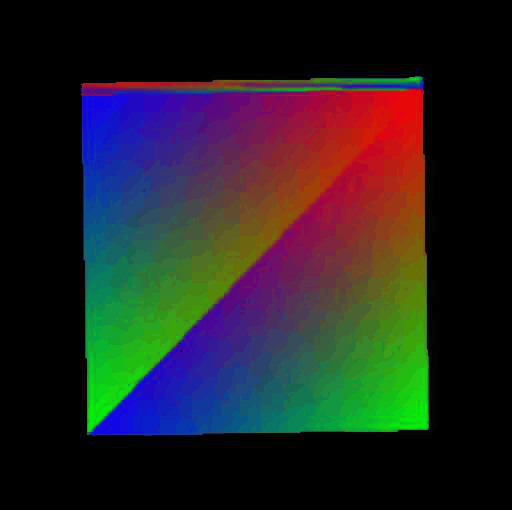
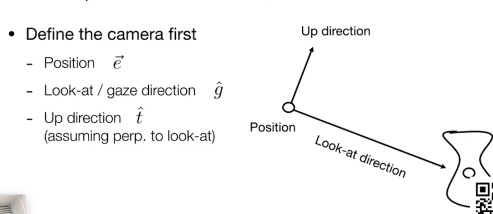
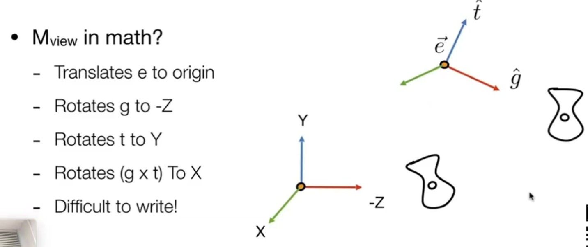
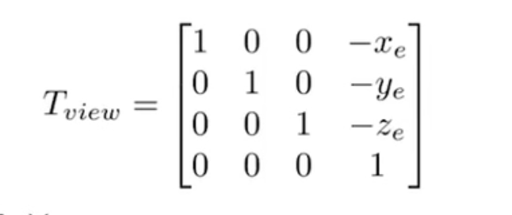
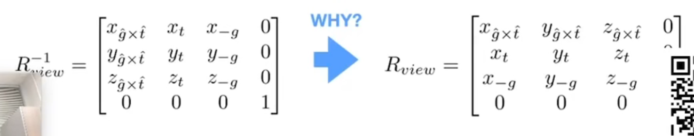
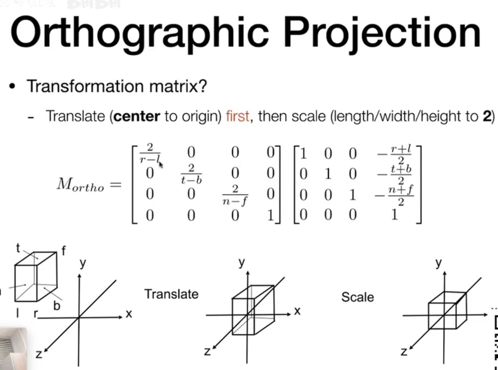
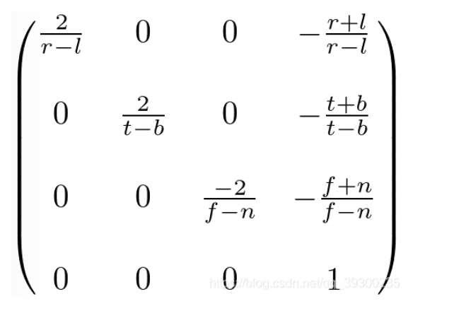
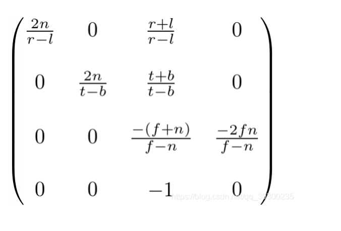
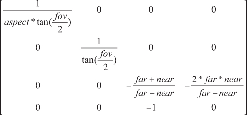
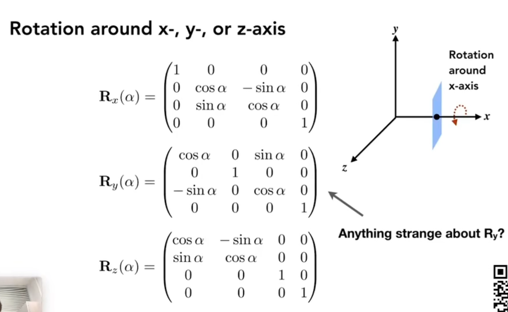

## **本节目标**
1. 输入一个点(x,y,z)和半径(radius)
2. 输出一个有颜色过渡的3D正方体在屏幕上，并自动按x/y/z任意方向旋转


完整实现可参见`demos/2-Camera`

## 准备工作
开始此节前，强烈建议学习Games101第3-4节，理解仿射变化，齐次坐标等概念，并对矩阵/向量运算有清晰认识
### **1.参考资料**
1. [计算机图形学：基础入门][1]
2. [线性代数：线性代数的本质][2]
3. [数学基础：数学乐][3]

[1]:https://www.bilibili.com/video/BV1X7411F744
[2]:https://www.bilibili.com/video/BV1ys411472E
[3]:https://www.shuxuele.com/

### **2. 常用的空间说明**
1. `local space`  （局部空间）
2. `world space`  （世界空间）
3. `view space`   （观察空间/相机空间）
4. `clip space`   （裁切空间/裁剪空间）
5. `screen space` （屏幕空间）

### **3. MVP变换+视口变换**
1. **model**（模型）变换： 将坐标从 `local space（局部空间）`-> `world space（世界空间）`
2. **view** （视图）变换：将坐标从 `world space（世界空间）`-> `view space（观察空间）`
3. **projection**（投影）变换： 将坐标从 `view space（观察空间）`-> `clip space（裁切空间）`
4. **viewport** （视口）变换： 将坐标从 `clip space（裁切空间）`-> `screen space（屏幕空间）`

## **工作开始**
### **1. 实现相机**

现实生活中，我们为了将眼镜观察到的物体，展现在2D的屏幕/相纸上，发明了照相机

而在计算机图形学中，为了将三维物体映射在二维的屏幕上，则沿用了照相机这个概念


那我们在现实生活中，怎么拍一张照片呢？（引用Games101课程PPT，讲的非常好）
- 找一个好的地方，把人都聚在一起（model transformation/模型变换)
- 找一个好的角度，放置照相机（view transformation/视图变换）
- 茄子（projection transformation/投影变换）

#### **如何建立相机坐标系？**



- position（相机放在什么位置） 
- lookAt （相机往哪看）向量g
- up （相机的向上方向）向量t

要建立摄像机坐标系，需要先确定观察方向，即需要确定position和lookAt

- position-lookAt得到相机-z轴
- -z轴叉乘 (0,1,0)向量得到相机x轴
- 相机z轴叉乘x轴，得到相机y轴

```
    /**
     * 相机x轴
     *      t x z
     * x = -------
     *    ||t x z||
     */
    private _x: Vec4;
    public get x(): Vec4 {
        if (!this._x) {
            const t = new Vec4(0, 1, 0);
            this._x = t.cross(this.z).normalize();
        }
        return this._x;
    }

    /**
     * 相机y轴 
     * y = z 叉乘 x
     */
    private _y: Vec4;
    public get y(): Vec4 {
        if (!this._y) {
            this._y = this.z.cross(this.x).normalize();
        }
        return this._y;
    }

    /**
     * 相机z轴 （相机lookAt到position的向量）
     *         g
     * z = -  ---
     *       ||g||
     */
    private _z: Vec4;
    public get z(): Vec4 {
        if (!this._z) {
            const { _position, _lookAt } = this;
            this._z = _position.sub(_lookAt).normalize();
        }
        return this._z;
    }
```

#### **视图变换**

我们还有一个常识，就是保持相同运动的物体间，是相对静止的；

假设相机和要拍摄的物体都保持相同的运动，那么拍摄出来的照片，应该是始终相同的

利用这个特性，计算机图形学中为了方便计算，常常做如下设定：

- 相机位置(position)放在坐标系原点(0,0,0)上
- lookAt看向-z
- up则与y轴重合

那么这些在数学上怎么表示呢？



1. 平移
- 把position移到坐标原点(0,0,0)
2. 旋转
- 将lookAt（向量g）旋转到-Z轴
- 将up(向量t)旋转到Y轴
- 将（向量g x 向量t)旋转到X轴

平移矩阵很好写，就是齐次坐标的最后一列分别为`-position.x,-position.y,-position.z,1`



再看旋转过程，用矩阵表达就非常困难；但咱们知道，变换是可逆的，那我们把上面的过程反过来，然后再求逆，是不是就可以呢？

答案是肯定的，我们把上面的旋转过程表示为

- 将X轴 旋转到（向量g x 向量t)
- 将Y轴 旋转到 up（向量t）
- 将-Z轴 旋转到 lookAt（向量g）
- 求矩阵的逆（因为旋转矩阵是正交矩阵，所以矩阵的逆 == 矩阵的转置）

这样，相机的视图变换数学表示，我们就得到了



#### **投影变换**

- near 近平面
- far 远平面
- fov 视场角
- aspect 宽高比

1. 正交投影





先把一个[left,right] x [bottom,top] x [far,near]的立方体，平移+缩放至一个[-1,1]的规则立方体中（为什么要这么做？目的就是为了方便计算）

```
    /**
     * 获取正交投影矩阵 
     * 2/(r-l)   0      0     -(r+l)/(r-l)
     *   0    2/(t-b)   0     -(t+b)/(t-b)
     *   0       0   -2/(f-n) -(f+n)/(f-n)
     *   0       0      0           1
     */
    public getOrthographicMatrix(
        left: number,
        right: number,
        top: number,
        bottom: number,
        near: number,
        far: number
    ): Mat4 {
        const mat = new Mat4();
        mat.setWithNum(
            2 / (right - left), 0, 0, -(right + left) / (right - left),
            0, 2 / (top - bottom), 0, -(top + bottom) / (top - bottom),
            0, 0, -2 / (far - near), -(far + near) / (far - near),
            0, 0, 0, 1
        )
        return mat;;
    }
```

2. 透视投影





```
    /**
     * 获取透视投影矩阵 
     * 1/aspect*tan(fov/2)       0             0            0
     *    0                 1/tan(fov/2)       0            0
     *    0                      0        -(f+n)/(f-n)  -2fn/(f-n)
     *    0                      0             -1           0
     * */
    public getPerspectiveMatrix(
        fov: number,
        aspect: number,
        near: number,
        far: number
    ): Mat4 {
        const mat = new Mat4();
        const rad = (Math.PI / 180) * fov;
        mat.setWithNum(
            1 / (Math.tan(rad / 2) * aspect), 0, 0, 0,
            0, 1 / Math.tan(rad / 2), 0, 0,
            0, 0, -(far + near) / (far - near), -2 * (far * near) / (far - near),
            0, 0, -1, 0
        )
        return mat;;
    }
```
完整推导过程，请参见Games101课程

完整`camera`实现见`demos/2-Camera/camera.ts`


### **2. 实现网格**

- VBO存储顶点数据
- EBO存储顶点的顺序

```
// 顶点数据 存储顶点位置 
export class Vertex {
    position: Vec4;

    constructor(x: number = 0, y: number = 0, z: number = 0, w: number = 0) {
        this.position = new Vec4(x, y, z, w);
    }
}

export class Mesh {
    public VBO: Array<Vertex>;
    public EBO: Array<number>;
    constructor() {
        this.VBO = new Array();
        this.EBO = new Array();
    }
}
```
### **3. 画正方体**

```
export class Mesh {
    public VBO: Array<Vertex>;
    public EBO: Array<number>;
    constructor() {
        this.VBO = new Array();
        this.EBO = new Array();
    }

    /**
     * 创建三角形
     */
    createTriangle(v1: Vertex, v2: Vertex, v3: Vertex) {
        const { VBO, EBO } = this;
        const idx = VBO.length;
        VBO.push(v1, v2, v3);
        EBO.push(idx, idx + 1, idx + 2);
    }

    public createTriangleWithArray(points: Array<Vertex>) {
        this.createTriangle(points[0], points[1], points[2]);
    }

    /**
     * 创建矩形面
     * 0 --- 3
     * |  \  |
     * |   \ |
     * 1 --- 2
     * 将矩形面分为两个三角形 分别渲染 逆时针存放
     * 左012 右023
     */
    createRect(
        leftTop: Vec4,
        leftBottom: Vec4,
        rightBottom: Vec4,
        rightTop: Vec4,
    ) {
        const mesh = new Mesh();
        const points = [leftTop, leftBottom, rightBottom, rightTop];
        const vertexes: Array<Vertex> = [];
        for (let i = 0; i < 4; ++i) {
            const vertex = new Vertex();
            vertex.position = points[i].clone();
            vertexes.push(vertex);

        }
        this.createTriangleWithArray([0, 1, 2].map(idx => vertexes[idx]));
        this.createTriangleWithArray([0, 2, 3].map(idx => vertexes[idx]));
        return mesh;
    }

    private createPlaneWithArray(points: Array<Vec4>) {
        this.createRect(points[0], points[1], points[2], points[3]);
    }

    /**
     * 创建正方体（后续可以优化顶点复用）
     * 只需要8个点 前后各四个(然后分别用点组成6个面即可)
     * 0123前面 4567后面 
     * 4510左面 3267右面 
     * 4037上面 1562下面
     */
    createBox(center: Vec4, radius: number) {
        const { x, y, z } = center;
        // 一共就8个点
        const points = [
            // 前面
            // leftTop
            new Vec4(x - radius, y + radius, z + radius, 1),
            // leftBottom
            new Vec4(x - radius, y - radius, z + radius, 1),
            // rightBottom
            new Vec4(x + radius, y - radius, z + radius, 1),
            // rightTop
            new Vec4(x + radius, y + radius, z + radius, 1),

            // 后面
            // leftTop
            new Vec4(x - radius, y + radius, z - radius, 1),
            // leftBottom
            new Vec4(x - radius, y - radius, z - radius, 1),
            // rightBottom
            new Vec4(x + radius, y - radius, z - radius, 1),
            // rightTop
            new Vec4(x + radius, y + radius, z - radius, 1),
        ];

        // TODO 面顶点顺序为什么和面剔除有关 理清楚关系

        // 前
        this.createPlaneWithArray([0, 1, 2, 3].map(idx => points[idx]).concat(new Vec4(0, 0, 1)));
        // 后
        this.createPlaneWithArray([7, 6, 5, 4].map(idx => points[idx]).concat(new Vec4(0, 0, -1)));
        // 左
        this.createPlaneWithArray([4, 5, 1, 0].map(idx => points[idx]).concat(new Vec4(-1, 0, 0)));
        // 右
        this.createPlaneWithArray([3, 2, 6, 7].map(idx => points[idx]).concat(new Vec4(1, 0, 0)));
        // 上
        this.createPlaneWithArray([3, 7, 4, 0].map(idx => points[idx]).concat(new Vec4(0, 1, 0)));
        // 下
        this.createPlaneWithArray([1, 5, 6, 2].map(idx => points[idx]).concat(new Vec4(0, -1, 0)));
    }
}
```
### **4. 旋转正方体**



1. X轴旋转矩阵

```
    /**
     * 获取绕X轴旋转 旋转矩阵
     * 1   0     0    0
     * 0  cos  -sin   0
     * 0  sin   cos   0
     * 0   0     0    1
     * @param {number} angle 
     * @returns {Mat4} 
     */
    static getRotationMat4X(angle: number): Mat4 {
        const mat = new Mat4();
        const radian = (Math.PI / 180) * angle;
        const cos = Math.cos(radian);
        const sin = Math.sin(radian);
        mat.set(0, 1);
        mat.set(5, cos);
        mat.set(6, -sin);
        mat.set(9, sin);
        mat.set(10, cos);
        mat.set(15, 1);
        return mat;
    }
```

2. Y轴旋转矩阵

```
    /**
     * 获取绕Y轴旋转 旋转矩阵
     *  cos  0  sin   0
     *   0   1   0    0
     * -sin  0  cos   0
     *   0   0   0    1
     * @param {number} angle 
     * @returns {Mat4} 
     */
    static getRotationMat4Y(angle: number): Mat4 {
        const mat = new Mat4();
        const radian = (Math.PI / 180) * angle;
        const cos = Math.cos(radian);
        const sin = Math.sin(radian);
        mat.set(0, cos);
        mat.set(2, sin);
        mat.set(5, 1);
        mat.set(8, -sin);
        mat.set(10, cos);
        mat.set(15, 1);
        return mat;
    }
```

3. Z轴旋转矩阵

```
    /**
     * 获取绕Z轴旋转 旋转矩阵
     * cos  -sin   0   0 
     * sin   cos   0   0
     *  0     0    1   0 
     *  0     0    0   1
     * @param {number} angle 
     * @returns {Mat4} 
     */
    static getRotationMat4Z(angle: number): Mat4 {
        const mat = new Mat4();
        const radian = (Math.PI / 180) * angle;
        const cos = Math.cos(radian);
        const sin = Math.sin(radian);
        mat.set(0, cos);
        mat.set(1, -sin);
        mat.set(4, sin);
        mat.set(5, cos);
        mat.set(10, 1);
        mat.set(15, 1);
        return mat;
    }
```

4. 将mvp矩阵中的model矩阵，更换为旋转矩阵，每帧增加angle，达到Box转动的效果


## **进阶学习**
### **1. 深度检测**

我们可以观察到，上述流程渲染出来的结果，在旋转时看起来有点奇怪，像是后面的面透了过来，不符合前面遮挡后面这一物理规律

那这是为什么呢？

因为啊，我们的渲染器在渲染每个三角形的时候，并不知道谁在前，谁在后，按顺序渲染每个三角形内的每个像素点，就有可能出现后面的面被渲染

那我们如何改善这一点呢？

- 记录前后（深度信息 z坐标）
- 根据深度信息，每个像素，只渲染离相机最近的颜色

```

function clearZBuffer() {
    zBuffer = new Float32Array(width * height).fill(Infinity);
}

// 根据当前像素位置信息(x,y)获取深度信息数组中的下标index
function getZBufferIndexWithPosition(x: number, y: number): number {
    return x + y * width;
}

// 根据当前像素位置信息(x,y) 设置对应深度的值为zIndex
function setZBufferWithPosition(x: number, y: number, zIndex: number) {
    zBuffer[getZBufferIndexWithPosition(x, y)] = zIndex;
}

// 根据当前像素位置信息(x,y) 获取对应深度的值zIndex
function getZBufferWithPosition(x: number, y: number): number {
    return zBuffer[getZBufferIndexWithPosition(x, y)];
}

// 深度检测 根据当前像素位置信息(x,y) 检测是否需要更新对应的深度信息，并且该颜色需要渲染到该像素上
function zBufferTest(x: number, y: number, zIndex: number): boolean {
    const oldZIndex = getZBufferWithPosition(x, y);
    // z越小 离人眼越近
    if (oldZIndex > zIndex) {
        setZBufferWithPosition(x, y, zIndex);
        return true;
    }
    return false;
}
```
画三角形时，需要增加zBuffer测试
```
// 画渐变三角形
function drawTriangle(vertex1: Vec4, vertex2: Vec4, vertex3: Vec4) {
    const { xMin, xMax, yMin, yMax } = getBoundingBox(vertex1, vertex2, vertex3, width, height);
    for (let x = xMin; x < xMax; ++x) {
        for (let y = yMin; y < yMax; ++y) {
            const barycentricCoord = barycentric(x, y, vertex1, vertex2, vertex3);
            if (barycentricCoord.x < 0 ||
                barycentricCoord.y < 0 ||
                barycentricCoord.z < 0
            )
                continue;

            // 根据顶点插值每个像素点的z
            const z = vertex1.z * barycentricCoord.x + vertex2.z * barycentricCoord.y + vertex3.z * barycentricCoord.z;
            // 进行zBuffer测试
            if (!zBufferTest(x, y, z)) continue;
            writeColor(frameData, x, y, width, lerp(barycentricCoord, Color.RED, Color.GREEN, Color.BLUE));
        }
    }
}
```

每帧清除zBuffer
```
const update = () => {
    // 省略上面代码
    clearZBuffer();
    drawMesh(modelMat);
    render(canvas, ctx, frameBuffer);
    requestAnimationFrame(update);
}
```


### **2. 背面剔除**

立方体有6个面，但是任意时间，我们只能看到3个面，我们完全可以只渲染能看到的3个面，减少多余的面的渲染，提高渲染效率

1. 如何定义正面和背面？
- 顶点绘制顺序为逆时针的是正面
- 顶点绘制顺序为顺时针的是背面

2. 如何用数学表示（具体的算法）？
- 以三角形的任意一点为基准，按逆时针方向分别用其他两个顶点坐标，减此点坐标，得到两个向量
- 用上述两个向量叉乘得到面的法向量
- 上述法向量和观察方向夹角小于90度（点乘<0），则为背面

```
// 面剔除
function faceCulling(v1: Vec4, v2: Vec4, v3: Vec4) {
    const line1 = v2.sub(v1);
    const line2 = v3.sub(v1);

    const normal = line1.cross(line2).normalize();
    const view = new Vec4(0, 0, 1);
    const dot = normal.dot(view);
    return dot < 0;
}
```
修改画网格
```
// 画网格
function drawMesh(modelMat: Mat4) {
    for (let i = 0; i < mesh.EBO.length; i += 3) {
        // 省略上面
        NDC(windowPos1);
        NDC(windowPos2);
        NDC(windowPos3);

        // 背面剔除检测 如果是背面 此三角形就不渲染
        if (faceCulling(windowPos1, windowPos2, windowPos3)) continue;
        // 省略下面代码
    }
}
```


