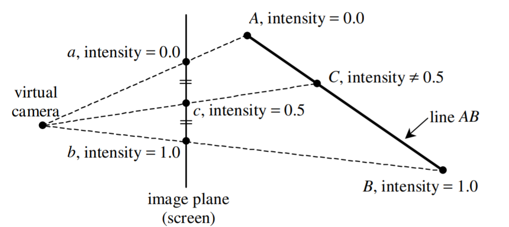

## **本节目标**
1. 输入一个点(x,y,z)和半径(radius)，并给定一张贴图
2. 输出一个3D立方体到2D屏幕，且每个面都显示为上述贴图，并自动按x/y/z任意方向旋转


完整实现可参见`demos/3-Textures`

## **工作开始**
### **uv**
计算机图形学中，常常提到uv坐标，那uv坐标是什么呢？

我理解，uv坐标，就是三维的物体上任意一点，在二维纹理的映射，我们可以用uv从二维的纹理上获取纹素，来渲染三维物体对应点的颜色，这样一张纹理贴图，就被贴在了三维模型上

实际开发过程中，模型顶点存储的uv，以及其对应的纹理，其实是建模/美术人员在美术软件中完成的，我们只需要拿来用就好，本节内容也给定一个简单的映射关系

- (u,v)坐标的范围均为[0,1]
- u和纹理坐标x的对应关系为：`x = u * 贴图宽 - 0.5`
- v和纹理坐标y的对应关系为：`y = (1 - v) * 贴图高 - 0.5`

```
 // (u,v) from [0,1]
 const x = u * texture.width - 0.5;
 const y = (1 - v) * texture.height - 0.5;
```
### **贴图**

1. 加载贴图
```
export async function loadImage(path: string): Promise<ImageData> {
    return new Promise<ImageData>((resolve, reject) => {
        try {
            let image = new Image();
            image.crossOrigin = '*';
            image.onload = () => {
                const canvas: HTMLCanvasElement = document.getElementById('canvas') as HTMLCanvasElement;
                const ctx = canvas.getContext('2d');
                const { width, height } = canvas;
                canvas.width = image.width;
                canvas.height = image.height;
                ctx.drawImage(image, 0, 0, image.width, image.height);
                const imageData = ctx.getImageData(0, 0, image.width, image.height);
                image = undefined;
                canvas.width = width;
                canvas.height = height;
                resolve(imageData)
            }

            image.src = path;
        }
        catch (e) { reject(e) }
    })
}
```

2. 存储纹素，并根据uv获取对应纹素
```
import { Color } from "./color";
import { loadImage } from "./loader";

export class Texture {
    private _imageData: ImageData;
    public get imageData(): ImageData {
        return this._imageData;
    }

    public get width(): number {
        return this._imageData?.width;
    }

    public get height(): number {
        return this._imageData.height;
    }

    private getColorWithXY(x: number, y: number): Color {
        const index = (x + y * this.width) * 4;
        const data = this._imageData.data;
        return new Color(
            data[index],
            data[index + 1],
            data[index + 2],
            data[index + 3]
        )
    }

    public setImageData(data: ImageData) {
        this._imageData = data;
    }

    public async setImageDataWithSrc(path: string) {
        const imageData = await loadImage(path);
        if (imageData) this._imageData = imageData;
    }

    public getColorWithUV(u: number, v: number): Color {
        if (!this._imageData) return Color.BLACK;
        if (u < 0 || v < 0 || u > 1 || v > 1) return Color.BLACK;
        const x = (u * this.width - 0.5);
        const y = ((1 - v) * this.height - 0.5);
        return this.getColorWithXY(Math.round(x), Math.round(y));
    }
}
```

### **修改渲染器**

1. 创建并初始化贴图

```
let textureLoaded = false;
const texture = new Texture();
texture.setImageDataWithSrc(T1).then(() => textureLoaded = true)
```

2. `Vertex`增加`uv`
```
export class Vertex {
    position: Vec4;
    u: number;
    v: number;

    constructor(x: number = 0, y: number = 0, z: number = 0, w: number = 0) {
        this.position = new Vec4(x, y, z, w);
    }
}
```

3. 创建`Box`的时候，初始化顶点`uv`

```
 createRect(
        leftTop: Vec4,
        leftBottom: Vec4,
        rightBottom: Vec4,
        rightTop: Vec4,
        normal: Vec4
    ) {
        // 省略上面代码 
        for (let i = 0; i < 4; ++i) {
            const vertex = new Vertex();
            vertex.position = points[i].clone();
            if (i == 0) {
                vertex.u = 0;
                vertex.v = 0;
            }
            else if (i == 1) {
                vertex.u = 0;
                vertex.v = 1;
            }
            else if (i == 2) {
                vertex.u = 1;
                vertex.v = 1;
            }
            else if (i == 3) {
                vertex.u = 1;
                vertex.v = 0;
            }
            vertexes.push(vertex);

        }
        // 省略下面代码
    }
```

4. 修改`drawTriangle`

- 入参类型修改为`Vertex`，并将使用坐标的地方，均替换为`vertex.position`
- 加载贴图后，使用贴图纹素渲染对应像素颜色

```
// 画渐变三角形
function drawTriangle(vertex1: Vertex, vertex2: Vertex, vertex3: Vertex) {
    const { xMin, xMax, yMin, yMax } = getBoundingBox(vertex1.position, vertex2.position, vertex3.position, width, height);
    for (let x = xMin; x < xMax; ++x) {
        for (let y = yMin; y < yMax; ++y) {
            const barycentricCoord = barycentric(x, y, vertex1.position, vertex2.position, vertex3.position);
            if (barycentricCoord.x < 0 ||
                barycentricCoord.y < 0 ||
                barycentricCoord.z < 0
            )
                continue;

            const z =
                vertex1.position.z * barycentricCoord.x
                + vertex2.position.z * barycentricCoord.y
                + vertex3.position.z * barycentricCoord.z;
            if (!zBufferTest(x, y, z)) continue;

            // 根据顶点uv 插值每个像素的uv
            const u =
                vertex1.u * barycentricCoord.x +
                vertex2.u * barycentricCoord.y +
                vertex3.u * barycentricCoord.z;

            const v =
                vertex1.v * barycentricCoord.x +
                vertex2.v * barycentricCoord.y +
                vertex3.v * barycentricCoord.z;

            // 贴图加载完成，则使用uv坐标获取纹素，使用纹素渲染当前像素颜色
            if (textureLoaded) {
                writeColor(frameData, x, y, width, texture.getColorWithUV(u, v));
            }
            else {
                writeColor(frameData, x, y, width, lerp(barycentricCoord, Color.RED, Color.GREEN, Color.BLUE));
            }
        }
    }
}
```

5. 修改`drawMesh`

创建新的顶点数据，position保存mvp变换+viewport变换后的屏幕坐标，并拷贝原有顶点的uv

```
// 画网格
function drawMesh(modelMat: Mat4) {
    for (let i = 0; i < mesh.EBO.length; i += 3) {
        // 省略上面代码
        const v2f1 = new Vertex(windowPos1.x, windowPos1.y, windowPos1.z, windowPos1.w);
        const v2f2 = new Vertex(windowPos2.x, windowPos2.y, windowPos2.z, windowPos2.w);
        const v2f3 = new Vertex(windowPos3.x, windowPos3.y, windowPos3.z, windowPos3.w);

        v2f1.u = v1.u;
        v2f1.v = v1.v;
        v2f2.u = v2.u;
        v2f2.v = v2.v;
        v2f3.u = v3.u;
        v2f3.v = v3.v;

        // 画三角形
        drawTriangle(v2f1, v2f2, v2f3);
    }
}
```

## **进阶学习**
1. 透视矫正

上述的实现，我们使用的是正交摄像机，如果我们切换为透视摄像机，会发现显示效果并不正确，纹理在非正对我们观察方向的时候，会出现扭曲

为了简单观察，我们选定按x轴转动


为什么会出现这样的现象呢？那是因为，我们是直接用屏幕空间的坐标进行插值



上图简单表述为，在屏幕空间(screen space)进行线性插值得到点c的intensity为0.5，但在观察空间(view space)得到的c的intensity并不为0.5，这也就造成了插值的误差


我们对三角形的每个点进行插值时，是根据顶点的坐标求出的，但透视投影之后的纹理坐标(u,v)，并非与投影点的坐标线性相关，观察上图可以看到，结果**并不与z成线性相关，而是与1/z成线性相关**

具体推导过程见 [深入探索透视纹理映射](https://blog.csdn.net/popy007/article/details/5570803)

那我们如何在代码中应用正确的插值呢？
- `Vertex`增加Z变量，保存NDC之前的w值（因为NDC之后，w就会变成1）
- 顶点坐标变换到屏幕坐标后，uv分别乘1/z (因为投影之后w即为-z，所以此处乘以-1/w)
- 画三角形时，先用乘了1/z以后的每个顶点uv进行插值，然后每个像素的uv分别乘z，还原

```
export class Vertex {
    position: Vec4;
    u: number;
    v: number;
    Z:number;

    constructor(x: number = 0, y: number = 0, z: number = 0, w: number = 0) {
        this.position = new Vec4(x, y, z, w);
    }
}
```

```
// 画网格
function drawMesh(modelMat: Mat4) {
    for (let i = 0; i < mesh.EBO.length; i += 3) {
        // 省略之前的代码
        // NDC之前 存储w分量
        const v1z = -1 / windowPos1.w;
        const v2z = -1 / windowPos2.w;
        const v3z = -1 / windowPos3.w;

        NDC(windowPos1);
        NDC(windowPos2);
        NDC(windowPos3);

        // 省略中间的代码

        // 存储w分量
        v2f1.Z = v1z;
        v2f2.Z = v2z;
        v2f3.Z = v3z;

        // uv都除以 -w
        v2f1.u = v1.u * v1z;
        v2f1.v = v1.v * v1z;
        v2f2.u = v2.u * v2z;
        v2f2.v = v2.v * v2z;
        v2f3.u = v3.u * v3z;
        v2f3.v = v3.v * v3z;

        // 画三角形
        drawTriangle(v2f1, v2f2, v2f3);
    }
}

// 画渐变三角形
function drawTriangle(vertex1: Vertex, vertex2: Vertex, vertex3: Vertex) {
    const { xMin, xMax, yMin, yMax } = getBoundingBox(vertex1.position, vertex2.position, vertex3.position, width, height);
    for (let x = xMin; x < xMax; ++x) {
        for (let y = yMin; y < yMax; ++y) {
            // 省略之前的代码

            // 插值得到还原uv要用的Z(-w)
            const Z =
                vertex1.Z * barycentricCoord.x +
                vertex2.Z * barycentricCoord.y +
                vertex3.Z * barycentricCoord.z;

            let u =
                vertex1.u * barycentricCoord.x +
                vertex2.u * barycentricCoord.y +
                vertex3.u * barycentricCoord.z;

            let v =
                vertex1.v * barycentricCoord.x +
                vertex2.v * barycentricCoord.y +
                vertex3.v * barycentricCoord.z;

            u *= 1 / Z;
            v *= 1 / Z;
            // 省略之后的代码
        }
    }
}
```
**正确结果**


