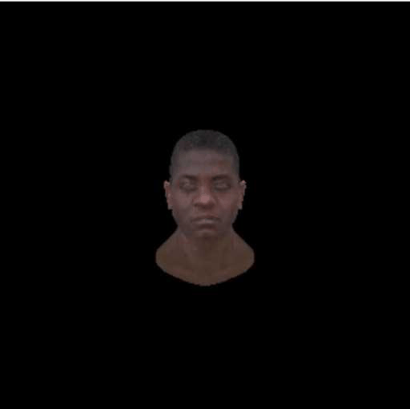
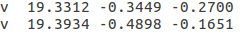
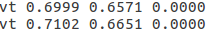
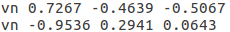
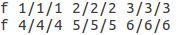

## **本节目标**
1. 给定一个模型(.obj)文件，和对应的纹理(.png)
2. 输出一个3D模型到屏幕，并自动按x任意方向旋转


## **准备工作**
本节之前，我们已经实现了
- 画三角形
- 画立方体
- 给立方体贴图

在开始本节之前，我希望先对之前的内容，做一些代码的重构/优化，让我们的toy代码，有一丢丢的像一个真正的引擎！

先来看一下 我们本节demo优化后的文件/目录结构

具体实现见`demos/4-Model`

```
.
├── base
│   ├── color.ts
│   ├── mat4.ts
│   ├── util
│   │   ├── calc.ts
│   │   └── common.ts
│   ├── vec4.ts
│   └── vertex.ts
├── core
│   ├── buffer.ts
│   ├── camera.ts
│   ├── loader.ts
│   ├── material.ts
│   ├── mesh.ts
│   ├── model
│   │   ├── face.ts
│   │   ├── model.ts
│   │   └── object.ts
│   ├── node.ts
│   ├── raster.ts
│   ├── scene.ts
│   ├── shader
│   │   ├── shader.ts
│   │   └── vertex_to_fragment.ts
│   └── texture.ts
├── index.html
├── index.ts
├── resources
│   ├── model1.obj
│   ├── model1.png
│   ├── model2.obj
│   ├── model2.png
│   ├── model3.obj
│   ├── model3_1.png
│   └── model3_2.png
```
### **1. buffer：屏幕渲染缓冲**
- 读/写屏幕缓冲
- 读/写深度缓冲
- 深度测试
- 使用指定颜色清除屏幕缓冲

### **2. model/mesh/material/shader：规范模型渲染**
- 模型（Model）可由多个对象（Object）组成
- 对象（Object）拥有网格（Mesh）和材质（Material）
- 网格（Mesh）储存了多边形的绘制信息，包括顶点位置、顶点法向、顶点纹理坐标，顶点索引
- 材质（Material）包含了漫反射光颜色、镜面反射光颜色、镜面反射光泽度等光照计算信息
- 纹理（Texture）数据和记录如何使用纹理的贴图（Map）信息
- 着色器（Shader）使用上述数据，对模型顶点/片元进行着色

### **3. scene/node：规范物体管理
- 场景（Scene）可有多个子节点（Node），并关联一个摄像机（Camera）
- 节点（Node）可有多个子节点

### **4. raster：规范渲染流程
- 光栅化
- 渲染网格

## **工作开始**

### **1. 理解.obj**

要加载/渲染模型之前，我们需要先理解**模型（.obj）文件格式**
.obj格式文件，有4中数据：
- v开头的       顶点
- vt开头的      纹理坐标
- vn开头的      顶点法向量
- f开头的       面

#### **顶点：v**



- 格式：v x y z
- 意义：每个顶点的坐标

#### **纹理坐标：vt**



- 格式：vt u v w
- 意义：绘制模型的三角形面时，每个像素点对应的纹理坐标（注意！纹理坐标左下角为(0,0)原点）
- 注意：w一般用于三维纹理，大多时候是用不到的，基本都为0

#### **顶点法向量：vn**



- 格式：vn x y z
- 意义：每个顶点的法向量，可用于确定三角面的方向（对三角面的每个顶点法向量做矢量和，即xyz的坐标分别相加再除以3得到）

#### **面：f**



- 格式：f v/vt/vn v/vt/vn v/vt/vn （f 顶点索引/纹理坐标索引/顶点法向量索引）
- 意义：绘制三角面的依据，每个三角面由三个f构成，由f可以确定顶点(x,y,z)，顶点对应的纹理坐标(u,v)，顶点法向量（通过三个顶点的法向量，可以确定三角面的方向）
- 注意：有些模型可能会出现四边形的绘制/记录方式，描述信息为 f v/vt/vn v/vt/vn v/vt/vn v/vt/vn 比三角面绘制方式多了一组 v/vt/vn

#### **补充说明**

- 顶点的个数和顶点法向量的个数一样多
- 顶点的个数不一定和纹理坐标的个数一样多，因为有可能很多顶点共用一个纹理坐标的像素
- 面索引的个数也与其余数据数量无关
- 三角面每个像素点的颜色，是根据三个顶点进行插值计算的，所以三角面的颜色有可能不与每个点颜色一致

## **2. 加载/解析模型**
了解了.obj的格式，我们就实现模型的加载和解析

- ajax请求，请求模型文件为文本
- 字符串操作，将v,vt,vn,f等信息筛检，将顶点信息存储在mesh中
- 根据usemtl字符，创建material，shader

```
    /**
     * 读取文本文件
     * @param {string} path 文本文件路径
     * @returns {string} 文本内容
     */
    private static async loadText(path: string): Promise<string> {
        return new Promise<string>((resolve, reject) => {
            const xhr = new XMLHttpRequest();
            xhr.open('GET', path);
            xhr.onreadystatechange = (ev) => {
                if (xhr.readyState === 4) {
                    if (xhr.status >= 200 && xhr.status < 300) {
                        resolve(xhr.responseText);
                    }
                    else {
                        reject(`http error, ${xhr.status}`)
                    }
                }
            }
            xhr.send();
        })
    }

    public static async loadModel(path: string): Promise<Model> {
        return new Promise<Model>(async (resolve, reject) => {
            try {
                let key = 'default';
                let needCreateObject = false;
                let objectCount = -1;
                const v: Array<Vec4> = [];
                const t: Array<Vec4> = [];
                const n: Array<Vec4> = [];
                const faces: Array<Face> = [];
                const text = await Loader.loadText(path);
                const model = new Model();
                const lines = text.replace(/\r/g, '').split('\n');
                lines.forEach(line => {
                    if (line.startsWith('v ')) {
                        v.push(Model.toVec4f(line, 'v '));
                        if (!needCreateObject) {
                            needCreateObject = true;
                            ++objectCount;
                            const object = new ModelObject();
                            model.addObject(object);
                        }
                    }
                    else if (line.startsWith('vt ')) t.push(Model.toVec4f(line, 'vt '));
                    else if (line.startsWith('vn ')) n.push(Model.toVec4f(line, 'vn '));
                    else if (line.startsWith('usemtl ')) {
                        key = line.substring('usemtl '.length);
                        const object = model.getObject(objectCount);
                        const material = new Material();
                        const shader = new Shader();
                        material.setShader(shader);
                        object.setMaterial(material);
                    }
                    else if (line.startsWith('f ')) {
                        const face = Model.toFace(line, key);
                        faces.push(face);
                        if (needCreateObject) {
                            needCreateObject = false;
                        }
                        const object = model.getObject(objectCount);
                        const mesh = object.getMesh();
                        const vers = [];
                        for (let i = 0; i < 3; ++i) {
                            const vert = new Vertex();
                            vert.position = v[face.v[i] - 1];
                            vert.normal = n[face.n[i] - 1];
                            const { x, y } = t[face.t[i] - 1];
                            vert.u = x;
                            vert.v = y;
                            vers.push(vert);
                        }
                        mesh.createTriangleWithArray(vers);
                    }
                })

                resolve(model);
            }
            catch (e) { reject(e); }
        })
    }
```

### **3. 创建场景**
```
const scene = new Scene();
```

### **4. 初始化相机参数**
```
const camera = scene.camera;
camera.setPosition(0, 0, -10);
camera.lookAt(0, 0, -1);
camera.usePerspectiveCamera();
camera.fov = 30;
camera.near = 1;
camera.far = 100;
```

### **5. 创建渲染器**
```
const raster = new Raster();
const { width, height } = raster;
```

### **6. 加载模型，创建材质和着色器**
```
let loaded = false;

const loadResource = async () => {
    const node = new Node();
    // 加载模型
    const model1 = await Loader.loadModel(Model1);
    node.model = model1;
    const { object: objects } = model1;

    for (let i = 0; i < objects.length; ++i) {
        const object = objects[i];
        const material = object.getMaterial() || new Material();
        const shader = material.getShader() || new Shader();
        if (!material.getShader()) material.setShader(shader);

        // 模型贴图
        const texture = new Texture();
        await texture.setImageDataWithSrc(Model1Tex);
        material?.setTexture(texture);

        shader.modelMatrix = CalcUtil.mat4MulArr([
            node.positionMat4,
            Mat4.getRotationMat4X(angle)
        ])

        shader.viewMatrix = camera.getViewMatrix();

        const { near, far, fov } = camera;
        const aspect = width / height;

        shader.projectionMatrix = camera.isOrthographicCamera()
            ? camera.getOrthographicMatrix(-width / 2, width / 2, height / 2, -height / 2, near, far)
            : camera.getPerspectiveMatrix(fov, aspect, near, far);
    }

    scene.addChild(node);
}

loadResource().then(() => loaded = true);
```

### **5. 自动旋转**
```
let angle = 0;
let autoRotation = true;
const dealAutoRotation = () => {
    angle += 1;
    scene.children.forEach(child => {
        const model = child.model;
        const objects = model.object;
        for (let i = 0; i < objects.length; ++i) {
            const object = objects[i];
            const shader = object.getMaterial()?.getShader();
            if (!shader) continue;
            shader.modelMatrix = CalcUtil.mat4MulArr([
                child.positionMat4,
                Mat4.getRotationMat4X(angle)
            ])
        }
    })
}
```

### **6. 渲染模型**
```
const update = () => {
    if (loaded) {
        if (autoRotation) dealAutoRotation();
        raster.render(scene);
    }
    requestAnimationFrame(update);
}

update();
```