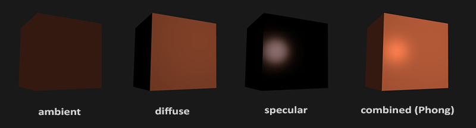
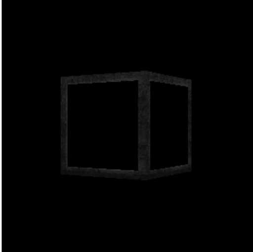
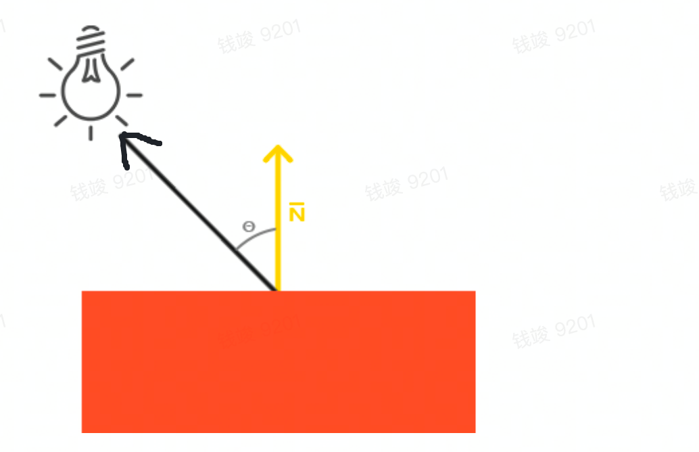
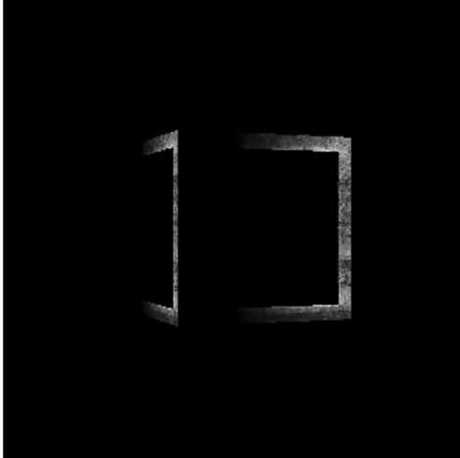
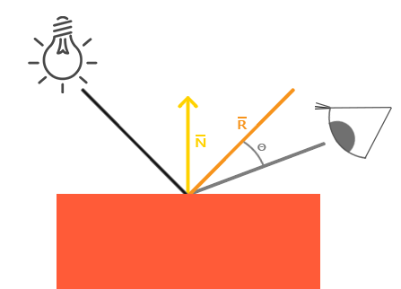
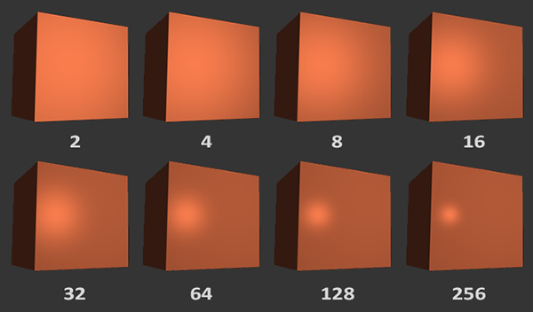
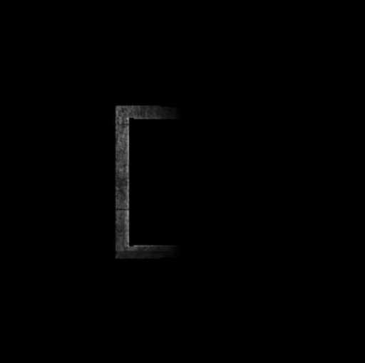

## **本节目标**
1. 根据光照（Phone模型），实现平行光，点光源和聚光灯
2. 使用3-Texture中的立方体，展示其在三种灯光下的效果

## **准备工作**

## **工作开始**
### **矩阵行列式**
```
export class Mat4{
/**省略其他代码*/
  static determinant(mat: Mat4): number {
    let value;
    const m00 = mat.get(0),
      m01 = mat.get(1),
      m02 = mat.get(2),
      m03 = mat.get(3),
      m10 = mat.get(4),
      m11 = mat.get(5),
      m12 = mat.get(6),
      m13 = mat.get(7),
      m20 = mat.get(8),
      m21 = mat.get(9),
      m22 = mat.get(10),
      m23 = mat.get(11),
      m30 = mat.get(12),
      m31 = mat.get(13),
      m32 = mat.get(14),
      m33 = mat.get(15);
    value =
      m03 * m12 * m21 * m30 -
      m02 * m13 * m21 * m30 -
      m03 * m11 * m22 * m30 +
      m01 * m13 * m22 * m30 +
      m02 * m11 * m23 * m30 -
      m01 * m12 * m23 * m30 -
      m03 * m12 * m20 * m31 +
      m02 * m13 * m20 * m31 +
      m03 * m10 * m22 * m31 -
      m00 * m13 * m22 * m31 -
      m02 * m10 * m23 * m31 +
      m00 * m12 * m23 * m31 +
      m03 * m11 * m20 * m32 -
      m01 * m13 * m20 * m32 -
      m03 * m10 * m21 * m32 +
      m00 * m13 * m21 * m32 +
      m01 * m10 * m23 * m32 -
      m00 * m11 * m23 * m32 -
      m02 * m11 * m20 * m33 +
      m01 * m12 * m20 * m33 +
      m02 * m10 * m21 * m33 -
      m00 * m12 * m21 * m33 -
      m01 * m10 * m22 * m33 +
      m00 * m11 * m22 * m33;
    return value;
  }
}
```
### **逆矩阵**
```
export class Mat4{
/**省略其他代码*/
  static invert(mat: Mat4): Mat4 {
    let m00 = mat.get(0),
      m01 = mat.get(1),
      m02 = mat.get(2),
      m03 = mat.get(3),
      m10 = mat.get(4),
      m11 = mat.get(5),
      m12 = mat.get(6),
      m13 = mat.get(7),
      m20 = mat.get(8),
      m21 = mat.get(9),
      m22 = mat.get(10),
      m23 = mat.get(11),
      m30 = mat.get(12),
      m31 = mat.get(13),
      m32 = mat.get(14),
      m33 = mat.get(15);
    m00 =
      m12 * m23 * m31 -
      m13 * m22 * m31 +
      m13 * m21 * m32 -
      m11 * m23 * m32 -
      m12 * m21 * m33 +
      m11 * m22 * m33;
    m01 =
      m03 * m22 * m31 -
      m02 * m23 * m31 -
      m03 * m21 * m32 +
      m01 * m23 * m32 +
      m02 * m21 * m33 -
      m01 * m22 * m33;
    m02 =
      m02 * m13 * m31 -
      m03 * m12 * m31 +
      m03 * m11 * m32 -
      m01 * m13 * m32 -
      m02 * m11 * m33 +
      m01 * m12 * m33;
    m03 =
      m03 * m12 * m21 -
      m02 * m13 * m21 -
      m03 * m11 * m22 +
      m01 * m13 * m22 +
      m02 * m11 * m23 -
      m01 * m12 * m23;
    m10 =
      m13 * m22 * m30 -
      m12 * m23 * m30 -
      m13 * m20 * m32 +
      m10 * m23 * m32 +
      m12 * m20 * m33 -
      m10 * m22 * m33;
    m11 =
      m02 * m23 * m30 -
      m03 * m22 * m30 +
      m03 * m20 * m32 -
      m00 * m23 * m32 -
      m02 * m20 * m33 +
      m00 * m22 * m33;
    m12 =
      m03 * m12 * m30 -
      m02 * m13 * m30 -
      m03 * m10 * m32 +
      m00 * m13 * m32 +
      m02 * m10 * m33 -
      m00 * m12 * m33;
    m13 =
      m02 * m13 * m20 -
      m03 * m12 * m20 +
      m03 * m10 * m22 -
      m00 * m13 * m22 -
      m02 * m10 * m23 +
      m00 * m12 * m23;
    m20 =
      m11 * m23 * m30 -
      m13 * m21 * m30 +
      m13 * m20 * m31 -
      m10 * m23 * m31 -
      m11 * m20 * m33 +
      m10 * m21 * m33;
    m21 =
      m03 * m21 * m30 -
      m01 * m23 * m30 -
      m03 * m20 * m31 +
      m00 * m23 * m31 +
      m01 * m20 * m33 -
      m00 * m21 * m33;
    m22 =
      m01 * m13 * m30 -
      m03 * m11 * m30 +
      m03 * m10 * m31 -
      m00 * m13 * m31 -
      m01 * m10 * m33 +
      m00 * m11 * m33;
    m23 =
      m03 * m11 * m20 -
      m01 * m13 * m20 -
      m03 * m10 * m21 +
      m00 * m13 * m21 +
      m01 * m10 * m23 -
      m00 * m11 * m23;
    m30 =
      m12 * m21 * m30 -
      m11 * m22 * m30 -
      m12 * m20 * m31 +
      m10 * m22 * m31 +
      m11 * m20 * m32 -
      m10 * m21 * m32;
    m31 =
      m01 * m22 * m30 -
      m02 * m21 * m30 +
      m02 * m20 * m31 -
      m00 * m22 * m31 -
      m01 * m20 * m32 +
      m00 * m21 * m32;
    m32 =
      m02 * m11 * m30 -
      m01 * m12 * m30 -
      m02 * m10 * m31 +
      m00 * m12 * m31 +
      m01 * m10 * m32 -
      m00 * m11 * m32;
    m33 =
      m01 * m12 * m20 -
      m02 * m11 * m20 +
      m02 * m10 * m21 -
      m00 * m12 * m21 -
      m01 * m10 * m22 +
      m00 * m11 * m22;

    const res = new Mat4();
    const det = Mat4.determinant(mat);
    res.setFromNumber(
      m00 / det,
      m01 / det,
      m02 / det,
      m03 / det,
      m10 / det,
      m11 / det,
      m12 / det,
      m13 / det,
      m20 / det,
      m21 / det,
      m22 / det,
      m23 / det,
      m30 / det,
      m31 / det,
      m32 / det,
      m33 / det
    );

    return res;
  }
}
```

### **标准光照模型（Phone模型）


1. 光照分量
- 环境光（ambient）：即使在黑暗的情况下，世界上通常也仍然有一些光亮（月亮、远处的光），所以物体几乎永远不会是完全黑暗的。为了模拟此现象，我们将使用环境光照常量，它会永远给物体一些颜色
- 漫反射（diffuse）：模拟光源对物体的方向性影响；它是冯氏光照模型中视觉上最显著的分量；物体的某一部分越是正对着光源，它就会越亮。
- 镜面高光（specular）：模拟有光泽物体上面出现的亮点。镜面光照的颜色相比于物体的颜色会更倾向于光的颜色

2. 计算公式
```
//objectColor代表物体颜色
result = objectColor * (ambient + difffuse + specular)
```

3. 灯光实现
```
// 灯光基类
export class Light {

    /**光源位置 */
    protected _position: Vec4;
    public getPosition(): Vec4 {
        return this._position;
    }
    public setPosition(position: Vec4) {
        if (!this._position) this._position = position.clone()
        else this._position.set(position.x, position.y, position.z, position.w);
    }

    /**光源颜色 */
    protected _color: Color;
    public getColor() {
        return this._color.clone().mul3(this._intensity);
    }
    public setColor(color: Color) {
        if (!this._color) this._color = color.clone()
        else this._color.set(color.r, color.g, color.b, color.a);
    }

    /**光源强度 */
    protected _intensity: number;
    public getIntensity(): number {
        return this._intensity;
    }
    public setIntensity(intensity: number) {
        this._intensity = intensity;
    }

    

    /**镜面光颜色 */
    protected _specularColor: Color;
    public getSpecularColor(): Color {
        return this._specularColor;
    }
    public setSpecularColor(color: Color) {
        if (!this._specularColor) this._specularColor = color.clone()
        else this._specularColor.set(color.r, color.g, color.b, color.a);
    }

    /**镜面反射强度 */
    protected _specularIntensity: number;
    public getSpecularIntensity(): number {
        return this._specularIntensity;
    }
    public setSpecularIntensity(intensity: number) {
        this._specularIntensity = intensity;
    }

    constructor() {
        // 光源设置
        this._position = new Vec4();
        this._color = Color.WHITE.clone();
        this._intensity = 1;

        // 环境光设置
        this._useAmbient = true;
        this._ambientColor = Color.WHITE.clone();
        this._ambientIntensity = 1;

        // 高光设置
        this._specularColor = new Color();
        this._specularIntensity = 1;
    }
}
```

4. 修改Shader，接收光照信息
```
export class Shader {
    constructor(uniform?: ShaderUniform) {
        if (uniform) this._uniform = uniform;
        else this._uniform = {};
    }

    private _uniform: ShaderUniform;
    public addUniform(key: string, value: any) {
        if (this._uniform[key]) return;
        this._uniform[key] = value;
    }
    public getUniform(key: string) {
        return this._uniform[key];
    }
    public modifyUniform(key: string, value: any) {
        this._uniform[key] = value;
    }
}
```

### **环境光**
光通常都不是来自于同一个光源，而是来自于我们周围分散的很多光源，即使它们可能并不是那么显而易见。光的一个属性是，它可以向很多方向发散并反弹，从而能够到达不是非常直接临近的点。所以，光能够在其它的表面上**反射**，对一个物体产生间接的影响。考虑到这种情况的算法叫做全局光照算法，但是这种算法既开销高昂又极其复杂。

我们先使用一个简化的全局照明模型，即**环境光照**。我们使用一个很小的常量（光照）颜色，添加到物体片元的最终颜色中，这样子的话即便场景中没有直接的光源也能看起来存在有一些发散的光。
把环境光照添加到场景里非常简单。我们用光的颜色乘以一个很小的常量环境因子，再乘以物体的颜色，然后将最终结果作为片元的颜色

1. 我们在灯光`Light`中添加环境光相关属性（但实际在一些主流的游戏引擎中，环境光作为场景`Scene`的属性，此处只是作为学习用途，放在灯光中，方便控制！）

```
Class Light {
    /**是否使用环境光 */
    protected _useAmbient: boolean;
    public isUseAmbient(): boolean {
        return this._useAmbient;
    }
    public useAmbient() {
        this._useAmbient = true;
    }
    public unUseAmbient() {
        this._useAmbient = false;
    }

    /**环境光颜色 */
    protected _ambientColor: Color;
    public getAmbientColor(): Color {
        return this._ambientColor;
    }
    public setAmbientColor(color: Color) {
        this._ambientColor = color;
    }

    /**环境光系数 */
    protected _ambientIntensity: number;
    public getAmbientIntensity(): number {
        return this._ambientIntensity;
    }
    public setAmbientIntensity(intensity: number) {
        this._ambientIntensity = intensity;
    }
}
```

1. 修改测试代码，添加灯光，在着色器中添加灯光颜色处理
```
    // 增加灯光
    light = new Light();
    light.setColor(Color.WHITE.clone());
    light.setPosition(new Vec4(10, 0, 0, 1));
    light.setIntensity(1);

    // 环境光
    light.useAmbient();
    light.setAmbientColor(Color.WHITE.clone());
    light.setAmbientIntensity(0.1);

    // 给着色器添加light属性
    shader.addUniform('light', light);
```

```
    /**片元着色 */
    public fragmentShader(vert2frag: Vert2Frag): Color {
        const { u, v, color: vColor, wordPosition, normal } = vert2frag;
        const color = new Color();
        if (!!this._texture) color.setWithColor(this._texture.getColorWithUV(u, v))
        else color.setWithColor(vColor)

        const light = this.getUniform('light') as Light;
        if (light) {
            // 如果使用环境光
            if (light.useAmbient) {
                const ambient = light.getAmbientColor().clone();
                const intensity = light.getAmbientIntensity();
                
                // 物体颜色乘上环境光*环境光系数
                color.mul(ambient.mul3(intensity), color);
            }
        }

        return color;
    }
```


### **漫反射**

漫反射，是投射在粗糙表面上的光向各个方向反射的现象。当一束平行的入射光线射到粗糙的表面时，表面会把光线向着四面八方反射，所以入射线虽然互相平行，由于各点的法线方向不一致，造成反射光线向不同的方向无规则地反射，这种反射称之为“漫反射”或“漫射”。这种反射的光称为漫射光。很多物体，如植物、墙壁、衣服等，其表面粗看起来似乎是平滑，但用放大镜仔细观察，就会看到其表面是凹凸不平的，所以本来是平行的太阳光被这些表面反射后，弥漫地射向不同方向。



1. 根据光入射方向和片元的法向量的夹角，计算漫反射颜色

- 入射方向：光源位置 - 顶点世界坐标 `light.position - Vert2Frag.worldPosition`
- 夹角余弦：物体法向量(归一化) 点乘 入射方向 `normal.normalize().dot(lightDir)`
- 漫反射颜色：灯光颜色 乘 夹角余弦（但因为余弦有可能为负值，所以需要Math.max取大于0的部分）
```
 /**片元着色 */
    public fragmentShader(vert2frag: Vert2Frag): Color {
        const { u, v, color: vColor, worldPosition, normal } = vert2frag;
        const color = new Color();
        if (!!this._texture) color.setWithColor(this._texture.getColorWithUV(u, v))
        else color.setWithColor(vColor)

        const light = this.getUniform('light') as Light;
        if (light) {
            // 入射方向
            const lightDir = light.getPosition().clone().sub(worldPosition);

            //用法向量 点乘 片元到光的方向 就是余弦值
            const cos = normal.normalize().dotVec3(lightDir);

            // 漫反射
            const diffuse = light.getColor().clone().mul3(Math.max(cos, 0));

            const phongColor = diffuse;

            if (light.useAmbient) {
                const ambient = light.getAmbientColor().clone();
                const intensity = light.getAmbientIntensity();
                phongColor.add(ambient.mul3(intensity));

                color.mul(phongColor, color);
            }
        }

        return color;
    }
```

看渲染结果，会发现越靠近光源的，越亮！（**但还是有些问题，比如亮的面不随着旋转发生变换，这个在进阶学习中优化！**）



### **镜面高光**
和漫反射光照一样，镜面光照也是依据光的方向向量和物体的法向量来决定的，但是它也依赖于观察方向，例如玩家是从什么方向看着这个片段的。镜面光照是基于光的反射特性。如果我们想象物体表面像一面镜子一样，那么，无论我们从哪里去看那个表面所反射的光，镜面光照都会达到最大化。你可以从下面的图片看到效果：



1. [计算反射方向](https://blog.csdn.net/yinhun2012/article/details/79466517)

反射方向 = 入射方向 - 法向量 x (入射方向.dot（法向量）x 2)

```
  public static reflect(lightDir: Vec4, normal: Vec4): Vec4 {
        const reflect = lightDir
            .sub(normal.clone().mul3(lightDir.dotVec3(normal) * 2))
            .normalize();
        return reflect;
    }
```

2. 计算镜面高光

镜面高光系数 = （观察方向.dot（反射方向））N次幂 （此处N取值32）



镜面高光颜色 = （高光初始色 x 高光系数 x 高光强度）
```
  // 反射方向
  const reflectDir = CalcUtil.reflect(lightDir, normal);

  // 高光
  const specularColor = Color.RED.clone();
  const specularIntensity = 0.5;
  const spec = Math.pow(Math.max(viewDir.dotVec3(reflectDir), 0), 32)
  const specular = specularColor.clone().mul3(specularIntensity * spec);
```

为了便于观察，给高光一个红色



### **平行光**

### **点光源**
### **聚光灯**


## **进阶学习**
### **1. 法线矩阵修正**
### **2. 聚光灯边缘软化**

